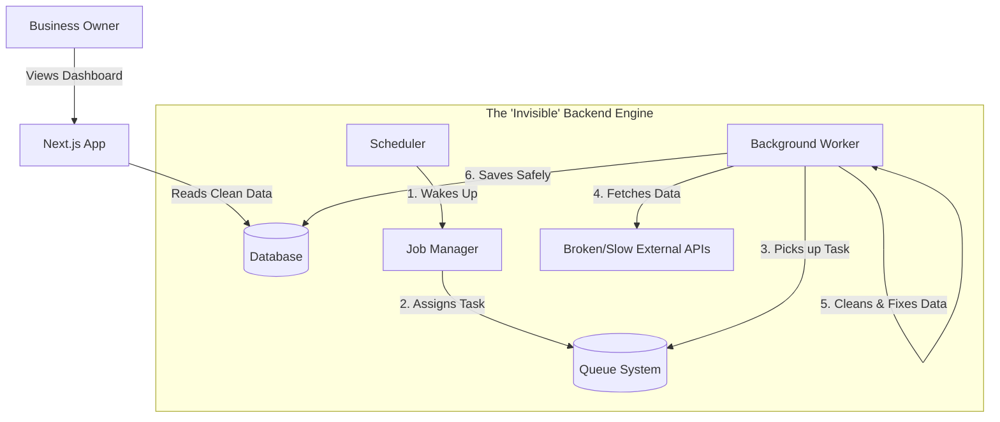

# Local Business Integration Hub (LBIH)

A centralized dashboard that pulls data from messy, unreliable sources and turns it into clean, usable business insights.

## Project Overview (The "Why")

Small businesses use too many tools (Shopify, Google Reviews, Booking apps), and none of them talk to each other. This project solves that fragmentation.

## The Engineering Challenge

Real-world APIs are messy. They timeout, crash, and send bad data.
I built a custom "Chaos Engine" to simulate network failures and bad data, proving that my system is resilient enough to handle real-world production environments.

## How It Works

## Key Features

### Data Sync (Fault Tolerance)
BullMQ + Redis
If an external service (like Shopify) goes down, my app doesn't crash. It patiently retries later, ensuring no data is ever lost.

### "Chaos" Resilience
Custom Chaos Server
I deliberately built a server that fails randomly (errors, delays, bad data) to test my system's stability. It forces the code to be robust, not fragile.

### Unified Data Language (Normalization)
Prisma ORM
Different apps format dates and money differently. I wrote a translation layer that standardizes everything, so the dashboard always looks consistent.

### Smart Traffic Control (Rate Limiting)
Exponential Backoff
The system automatically slows down if it's asking for data too fast, preventing the business from getting blocked by external providers.

### Tech Stack

Next.js 14
BullMQ + Redis
PostgreSQL
Docker
TypeScript

## Quick Start (For Developers)

The entire system (Dashboard, Database, Queue, and Chaos Server) is containerized for easy setup.
### Clone the repository
git clone [https://github.com/sospeterkedogo/Local-Business-Intergration-Hub.git](https://github.com/sospeterkedogo/Local-Business-Intergration-Hub.git)
cd Local-Business-Intergration-Hub

### Setup Environment
cp .env.example .env
### Run with Docker
docker-compose up --build
### Dashboard: http://localhost:3000
### Chaos Server (The "Bad" API): http://localhost:4000
See the Resilience in Action
You can watch the system handle failure in real-time by checking the server logs.
Click "Sync Now" on the Dashboard.
Open your terminal:
docker logs -f lbih-worker

## What you will see:

The worker effectively handling "Chaos":
Attempt 1 failed: External API Timeout. Retrying in 1s...
Attempt 2 failed: Rate Limit Hit. Backing off...
Attempt 3: Success! Data cleaned and saved.

## Project Structure

apps/web: The user-facing dashboard (Next.js).
apps/worker: The invisible engine that processes data (Node.js).
apps/chaos-api: The simulator that creates problems for the worker to solve.
